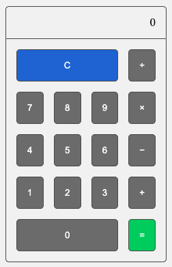

# Lambda Take Home Challenge - Week 1
- Task: CSS Grid Calculator  
- [Problem Link - Scotch.io](https://scotch.io/bar-talk/code-challenge-2-build-a-calculator-with-css-grid)   
- Design Spec:   


---
## Versions 
<details open>
<summary>0.1.0 - Calculation Logic</summary>

1. `<Calculator />`
    - `result` & `history` state being passed to `<ResultScreen />`
    -  `result`, `setResult` & `history`, `setHistory` state being passed to `<ButtonContainer />` 
2. `<ButtonContainer />` holds all calculation logic
    - `clear` => Resets `history` & `result` state 
    - `click` => Updates `history` state string
    - `calculate` => uses Javascript `eval()` to: 
        1. Calculate result from passed `history` state 
        2. Update `result` state
        3. Reset `history` state
</details>
<details>
<summary>0.0.4 - CSS Grid Layout</summary>

1. `<ButtonContainer/>`    
    - holds main CSS grid
    - imports `<Button/>` & `<ActionButton>`
        - `<Button/>` is rendering a passsed `num` prop
        - `<ActionButton/>` is passed a text `type`  prop which is filtered through a `switch` statement to render the [HTML Entities](https://www.freeformatter.com/html-entities.html)
2. All components using project themes imported from `index.css`

Screenshot:  

</details>
<details>
<summary>0.0.3 - CSS Reset & Color Variables</summary>

1. Meyer Reset: V2.0
    ```css
    /* reset.css */
    http://meyerweb.com/eric/tools/css/reset/ 
    v2.0 | 20110126
    License: none (public domain)
    ```

2. Color Variables
    ```css
    /* index.css */
    :root {
        --background_LightGrey: #F3F3F3;
        --clearButton_Blue: #3573DD;
        --equalButton_Green: #27D15E;
        --defaultButton_Grey: #767676;
        --text_and_line: #52514F;
    }
    ```
</details>
<details>
<summary>0.0.2 - Initial `< App />` Tests</summary>

1. Renders w/o crashing
2. queryByText => Hello World => toBeTruthy
</details>
<details >
<summary>0.0.1 - Create React App</summary>

- Cleaned out template CRA
- `<App/>` rendering 'Hello World' 
</details>

--- 
Author: Reed Turgeon  
Email: Turgeon.dev@gmail.com  
GitHub: https://github.com/MrT3313  
LinkedIn: https://www.linkedin.com/in/reedturgeon/  

